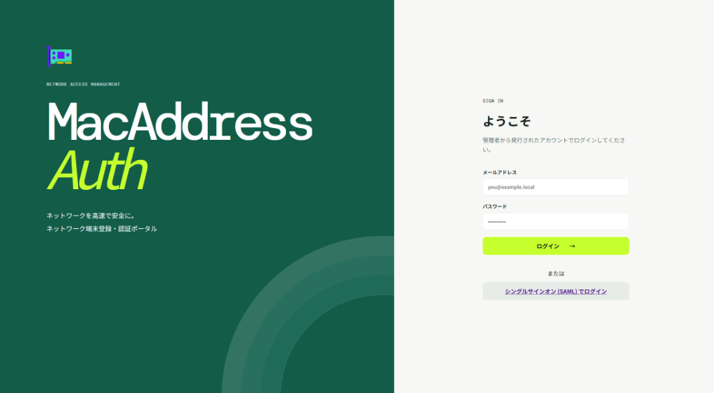
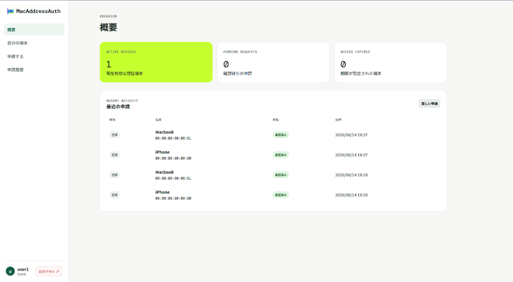

# MacAddressAuth

ネットワーク機器のMACアドレス認証を管理するポータルアプリケーションです。
FreeRADIUSと連携し、セキュアで高速なネットワークアクセスの提供を目的としています。

> [!NOTE]
> このアプリケーションのコードの大部分は、AI (Google Antigravity) によって自動生成および実装されています。

## 主な機能

* **認証端末の管理と申請ワークフロー**
  * 利用者は自身のネットワーク端末（MACアドレス）の登録・変更・削除を申請できます。
  * 管理者は申請内容をレビューし、承認することでRADIUSデータベースに即座に反映されます。
* **強力なダッシュボード**
  * 現在の有効な端末数、確認待ちの申請、有効期限切れが近い端末などを一目で確認できます。
* **シングルサインオン (SSO) 対応**
  * Azure AD (Entra ID) 等のSAML 2.0対応のアイデンティティプロバイダを使用したログインに対応しています。
* **高度な管理機能**
  * 全端末の一括管理、申請履歴の監査、接続ログ（Accounting）のエクスポート・パージ処理機能。
  * 保持期間を超過した古いログや無効なデータの自動クリーンアップ（監査ログ等）。

## スクリーンショット

### ログイン画面
SAMLを使用したシングルサインオンに対応しており、セキュアなログインを提供します。



### ダッシュボード
全体または自分自身の端末のステータスと、最近の申請状況を素早く確認できます。



## アーキテクチャ

* **Frontend**: Vanilla JavaScript (SPA), HTML5, CSS3
* **Backend**: Node.js, Express 5
* **Database**: PostgreSQL (RADIUSスキーマ対応)
* **Authentication**: Passport.js (SAML / Local)

## セットアップ手順

本アプリケーションは、Docker（`docker-compose`）を使用して簡単に起動・運用できるよう設計されています。

### 1. 前提条件
* Docker および Docker Compose がインストールされていること

### 2. 環境変数の設定
プロジェクトのルートディレクトリに `.env` ファイルを作成し、必要な環境変数を設定します（または、既存の `.env` を適宜変更してください）。

```env
# データベース接続 (docker-composeの定義に合わせる)
DATABASE_URL=postgres://macauth:macauth_secret@db:5432/radius

# アプリケーション設定
PORT=3000
SESSION_SECRET=your_secure_session_secret_here
RADIUS_MAC_FORMAT=colon # 'colon'(00:11:22:33:44:55), 'hyphen'(00-11-22-33-44-55), 'none'(001122334455)

# SAML (SSO) 設定 (任意)
# SAML_ENTRY_POINT=https://login.microsoftonline.com/.../saml2
# SAML_ISSUER=your-app-id-uri
# SAML_CERT=...
```

### 3. アプリケーションの起動
以下のコマンドを実行して、データベース（PostgreSQL）とアプリケーションコンテナを起動します。

```bash
docker compose up -d
```
> 初回起動時、バックグラウンドで自動的にデータベースの初期化（スキーマ作成・マイグレーション）が行われます。

### 4. 初期設定（管理者アカウントの作成）
コンテナが起動したら、ブラウザで `http://localhost:3000` にアクセスします。
データベースが初期状態の場合、**初回セットアップ画面**が表示されますので、最初の管理者アカウントを作成してください。

## FreeRADIUS との連携手順

本Webアプリケーションで登録したMACアドレス情報を用いて実際にネットワーク認証を行うため、FreeRADIUSにPostgreSQLモジュールを導入し連携させます。

### 1. PostgreSQL モジュールのインストール
```bash
# Ubuntu/Debian の場合
sudo apt install freeradius-postgresql
sudo ln -s /etc/freeradius/3.0/mods-available/sql /etc/freeradius/3.0/mods-enabled/
```

### 2. データベース接続設定
`/etc/freeradius/3.0/mods-available/sql` を編集し、本システムの PostgreSQL に接続するよう設定します。
```text
sql {
    driver = "rlm_sql_postgresql"
    server = "192.168.x.x"  # このWebサービスをホストしているサーバーのIP
    port = 5432
    login = "macauth"       # DBのユーザー名
    password = "..."        # DBのパスワード
    radius_db = "radius"    # DB名
    
    # テーブル名はデフォルトのまま (radcheck, radacct) で動作します
}
```

### 3. 認証・アカウンティングの組み込み
`/etc/freeradius/3.0/sites-available/default` （またはご使用の仮想サーバー設定ファイル）を編集します。
```text
authorize {
    ...
    sql
    ...
}
accounting {
    ...
    sql
    ...
}
```
※ `accounting` セクションに `sql` を追加することで、APから送信される接続・切断ログが `radacct` テーブルに保存され、本Webシステムの「接続ログ」から閲覧できるようになります。

### 4. MAC アドレスフォーマットの統一
本システムでは、ユーザーが入力したMACアドレスをデータベースのビュー（`radcheck` 等）で複数の形式に自動変換して保持しています。
そのため、基本的には **APやスイッチからどのフォーマット（コロン区切り、ハイフン区切り、区切り文字なし）で認証リクエストが送られてきても自動的にマッチして認証が可能**です。

環境変数 `RADIUS_MAC_FORMAT` は、画面表示時などのデフォルトフォーマットとして使用されます。
*   `colon` (既定): `AA:BB:CC:DD:EE:FF`
*   `hyphen`: `AA-BB-CC-DD-EE-FF`
*   `none`: `AABBCCDDEEFF`

設定後、FreeRADIUS を再起動（`sudo systemctl restart freeradius`）して連携をテストしてください。

## SAML (シングルサインオン) 連携手順

本システムは、Microsoft Entra ID (旧 Azure AD) 等の SAML 2.0 対応アイデンティティプロバイダ (IdP) と連携して、ユーザーのSSOログインおよび自動アカウント作成を行うことができます。

### 1. IdP側の設定
アイデンティティプロバイダ（例：Entra ID）側で、エンタープライズアプリケーションとしてSAMLアプリを作成します。
* **識別子 (Entity ID / Issuer)**: 本システムに設定する任意の文字列（例: `urn:macaddress-auth`）
* **応答 URL (ACS URL)**: `https://<本システムのドメイン>/auth/saml/callback`
* **要求される属性 (クレーム)**:
  * `http://schemas.xmlsoap.org/ws/2005/05/identity/claims/emailaddress` (必須: これをユーザーのメールアドレスとして利用します)
  * `http://schemas.microsoft.com/identity/claims/displayname` (任意: ユーザーの表示名として利用します)

### 2. 環境変数の設定
IdPから取得した情報を `.env` に設定します。設定方法には「メタデータURLを使用した自動設定」と「手動設定」の2種類があります。

#### 推奨: メタデータURLを使用した自動設定
IdPが提供する **App Federation Metadata URL** を指定するだけで、起動時に自動的に証明書やログインURLを取得・構成します。

```env
# SAML機能を有効化するための設定
SAML_METADATA_URL=https://login.microsoftonline.com/.../federationmetadata/2007-06/federationmetadata.xml
SAML_ISSUER=urn:macaddress-auth                                  # IdPに登録した識別子
```

#### 代替: 手動での設定
メタデータURLが利用できない場合は、各項目を手動で設定します。

```env
# SAML機能を有効化するための設定
SAML_ENTRY_POINT=https://login.microsoftonline.com/.../saml2   # IdPのログインURL
SAML_ISSUER=urn:macaddress-auth                                  # IdPに登録した識別子
SAML_CERT=MIIC8DCCAdigAwIBAgIQ...                                # IdPの公開鍵証明書（X.509 Base64形式）
```

上記を設定してアプリケーションを起動すると、ログイン画面に「シングルサインオン (SAML) でログイン」のボタンが表示され、SAML経由での認証が有効になります。
